# Introduction
This report documents the UW/TRAC method for truck routing for the FRATIS project. The application runs on a combination of PostgreSQL with PostGIS (the spatial data management and analysis package for PostgreSQL), which is responsible for the main analytic processes, and RStudio, which provides the run-time interface and rendering engine.

## Logic
The routing is performed using the `pgr_dijkstra` family of models in PostGIS. The logic follows these steps:

1. Origin and destination lat/long values are provided by the user
1. Within a proximity (default of 10 km) of these O/D points, a number of network vertices are selected (default of 10). This is necessary, rather than simply selecting the closest vertex, which could be on the wrong side of the roadway. 
1. For each pair of O/D vertices, a least-cost route is generated (where cost is the average time for a truck to traverse a road segment).
1. The route with the shortest duration is selected as the "base" route.
1. The start and end vertices for the base route are then used to generate routes passing by way of "via" alternate vertices using the `pgr_dijkstravia` function. The two fastest alternatives are selected as the "altbase" alternatives.
1. Optionally, delays can be introduced into the estimates of trip times. The travel bounding interval for each segment in the entire route is compared with the bounding interval of road work delays. If there is any time overlap affecting any segments in any of the routes, length-weighted apportioning of the delay is applied to the affected segments (i.e., by recomputing time to traverse the affected segments).
1. With "base" and "altbase" routes defined, a time-stepping algorithm is applied to estimate traversal time for each segment.
    1. Time of departure or arrival is specified.
    1. Stepping forward (or backward), segment by segment, the day of week (DOW) and hour of traversing the segment is used to pull related data from an empirical DOW/hour segment speed table, and the matching speed is applied to the segment.
    1. If delays are used, the additional time to traverse the segment is added.
    1. The steps are repeated for each segment, giving an estimate of the time stamp at the beginning and end of each segment.
1. Distances and travel times are summed across contiguously named road segments in the route (i.e., driving directions), and segments are aggregated by contiguous roadway name.

The name-aggregated routes are displayed in a web page with [Leaflet](https://rstudio.github.io/leaflet/) maps.

# Setup

## Inputs
```{r}
```

1. topologically connected network with NPMRDS IDs on segments
    requires pgCreateTopology fields as well as speed_delay float
1. "via" locations for generating alternative routes
1. NPMRDS time table data for assigning mean speeds per segment and for estimating travel time from time-stepping algorithm
1. work zones table (CSV format)
    1. single work zone ID related to one or more NPMRDS IDs
1. work zone delay table (CSV format)
    1. work zone ID with start and end time stamps and time delay for the entire zone
1. "Via" points for generating alternate routes. These were generated _ad hoc_ to establish some routes that may not have been on the main I-35 corridor, as shown in `r figure_nums(name = "cap_via", display = "cite")`.

```{r}
# get PostGIS data

# get data
myroute <- get_postgis_query(fratis, "select * from npmrds.roads_topo_vertices_pgr where id in (select id from npmrds.via_vertex)", geom_name="the_geom")
# sf type
myroutesf <- st_as_sf(myroute)
# to wgs84
myroutewgs84 <- st_transform(myroutesf, crs=4326)
# data frame for classes etc.
mydf <- myroutewgs84 %>% st_set_geometry(NULL)

# a leaflet
cap_via <- figure_nums(name = "cap_via", caption = "'Via' points for selecting alternate routes")
m <- leaflet(myroutewgs84) %>% addMarkers() %>% addTiles()
m
```
`r figure_nums(name = "cap_via", display = "full")`

## Software

1. [PostgreSQL](https://www.postgresql.org/) with [PostGIS](http://postgis.org/) (including pgRouting)
1. R suite
    1. [R](https://www.r-project.org/)
    1. [RStudio](https://www.rstudio.com/)
    1. [Shiny](https://www.rstudio.com/products/shiny/)
1. [QGIS](https://qgis.org/en/site/) (for cleaning road data)

The application and data were developed on Linux ([CentOS 7](https://centos.org/)).

# Data preparation steps

1. Clean road data (not necessary if high quality, topologically correct data are used)
1. Generate pgRouting topology (establishes network connectivity relationships, identifying segments and vertices)
    1. Starts with an "edge" (network) PostGIS table, generates a vertices (point) PostGIS table
1. Assign time of travel for each segment
    1. Obtain average speeds per TMC segment from NPMRDS
    1. Calculate travel time as impedance: $t = d / r$
    1. Assign reverse impedance (either a very high number or a negative number), to prevent from routing the wrong way on 1-way roadways
1. Create "work zone" CSV file enumerating zones and the TMCs within each zone (`r table_nums(name = "tcap0", display = "cite")`)
1. Create "work delays" CSV file enumerating zones, start and end time of work (`r table_nums(name = "tcap1", display = "cite")`)

```{r}
cz <- read.csv("/projects/fratis/npmrds/construction_zones.csv")
tcap0 <- table_nums(name = "tcap0", caption = "Work zones file")
kable(cz, format = "html", caption = tcap0) %>% kable_styling(bootstrap_options = c("striped", "hover", "condensed", "responsive"), full_width = F, position = "left")
```    

```{r}
cd <- read.csv("/projects/fratis/npmrds/construction_delays.csv")
tcap1 <- table_nums(name = "tcap1", caption = "Work delays file")
kable(cd, format = "html", caption = tcap1) %>% kable_styling(bootstrap_options = c("striped", "hover", "condensed", "responsive"), full_width = F, position = "left")
``` 

# Running
```{r, echo=FALSE}
cap_shiny <- figure_nums(name = "shiny", caption = "Run-time parameter inputs in Shiny")
```

Running the application is done in RStudio with Shiny. The Shiny application has data entry widgets for the various parameters (`r figure_nums(name = "shiny", display = "cite")`).

<div class = "outline">
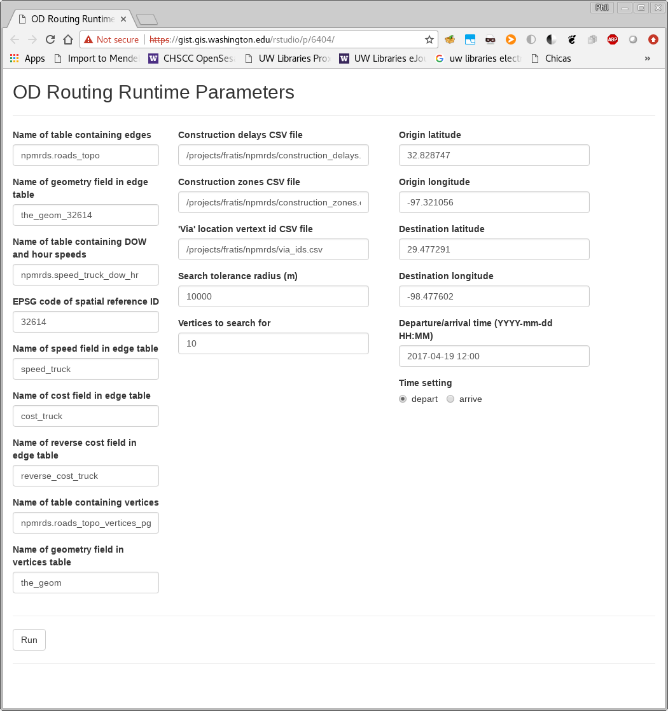
</div>
  \
`r figure_nums(name = "shiny", display = "full")`

As the system is running, messages are displayed in the RStudio console (`r figure_nums(name = "shinyrunning", display = "cite")`).
```{r, echo=FALSE}
cap_shinyrunning <- figure_nums(name = "shinyrunning", caption = "RStudio interface showing console messages")
```
<div class = "outline">
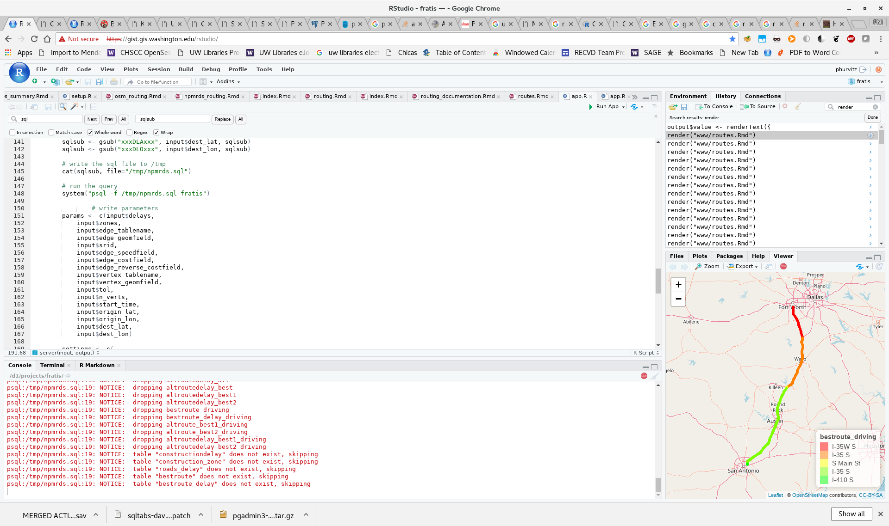
</div>
  \
`r figure_nums(name = "shinyrunning", display = "full")`

```{r, echo=FALSE}
cap_shinyrunning <- figure_nums(name = "shinydone", caption = "Shiny interface showing run completed")
```

When the run is complete, the Shiny window will show "DONE" at the bottom and present a hyperlink to the page displaying route information in tabular and mapped formats (`r figure_nums(name = "shinydone", display = "cite")`).

<div class = "outline">
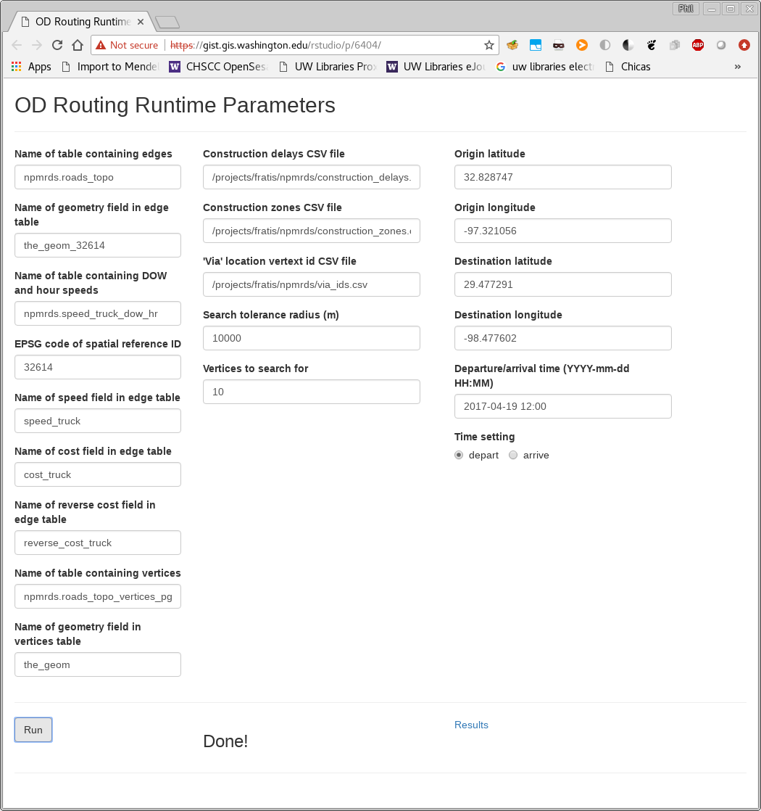
</div>
  \
`r figure_nums(name = "shinydone", display = "full")`

Run time parameters file example:

```{r}
params <- read.csv("params.csv")
tcap2 <- table_nums(name = "tcap2", caption = "Run time parameters")
kable(params, format = "html", caption = tcap2) %>% kable_styling(bootstrap_options = c("striped", "hover", "condensed", "responsive"), full_width = F, position = "left")
``` 

# Results
A sample of results is shown in `r figure_nums(name = "result0", display = "cite")` and `r figure_nums(name = "result1", display = "cite")`.
```{r, echo=FALSE}
cap_result0 <- figure_nums(name = "result0", caption = "Example of completed run")
cap_result1 <- figure_nums(name = "result1", caption = "Example of completed run")
```

<div class = "outline">
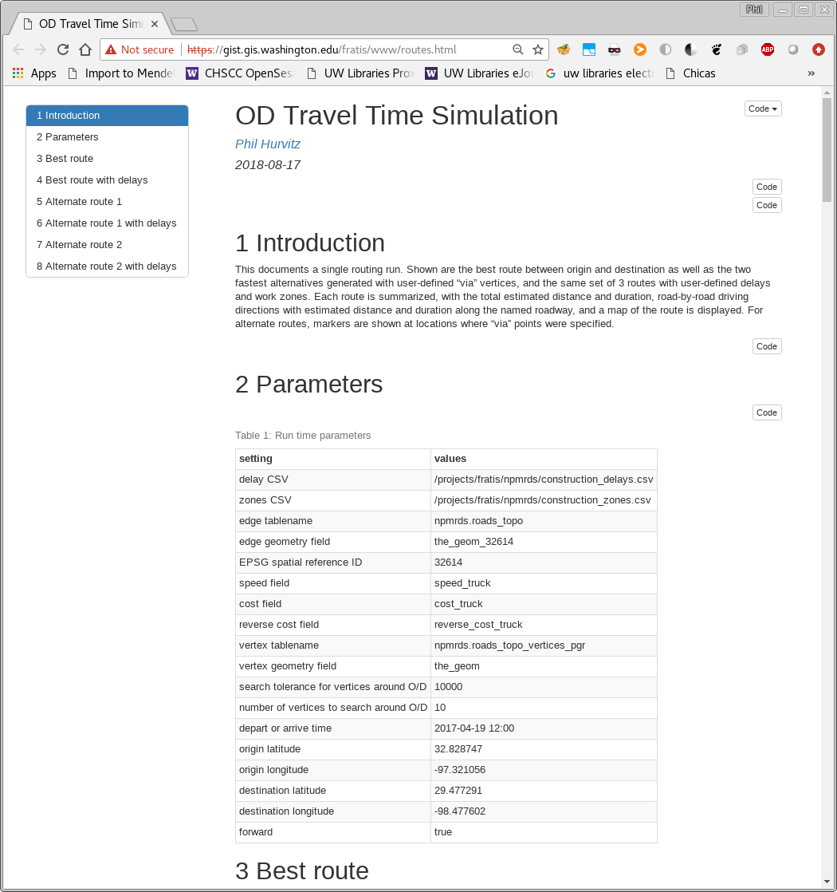
</div>
  \
`r figure_nums(name = "result0", display = "full")`

<div class = "outline">
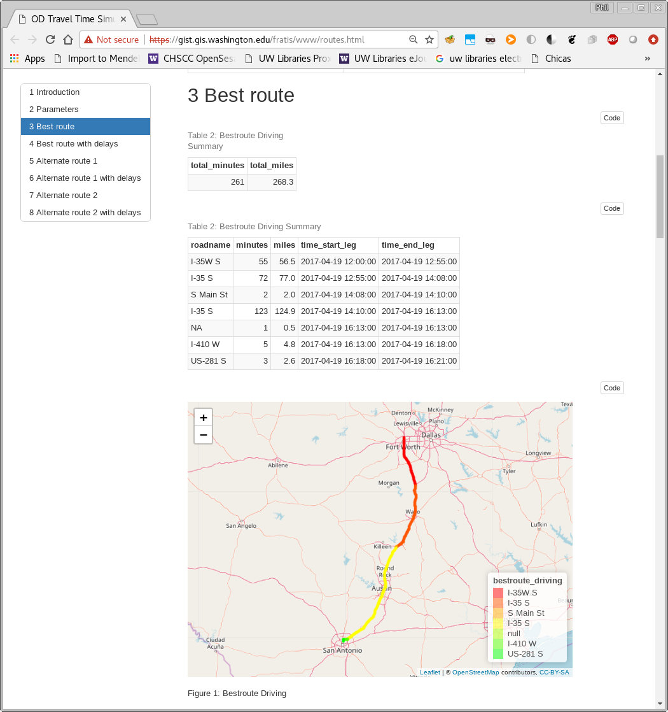
</div>
  \
`r figure_nums(name = "result1", display = "full")`


A results using arrival time is shown in `r figure_nums(name = "result2", display = "cite")`.
```{r, echo=FALSE}
cap_result2 <- figure_nums(name = "result2", caption = "Example of completed run using arrival time as a parameter")
```

<div class = "outline">
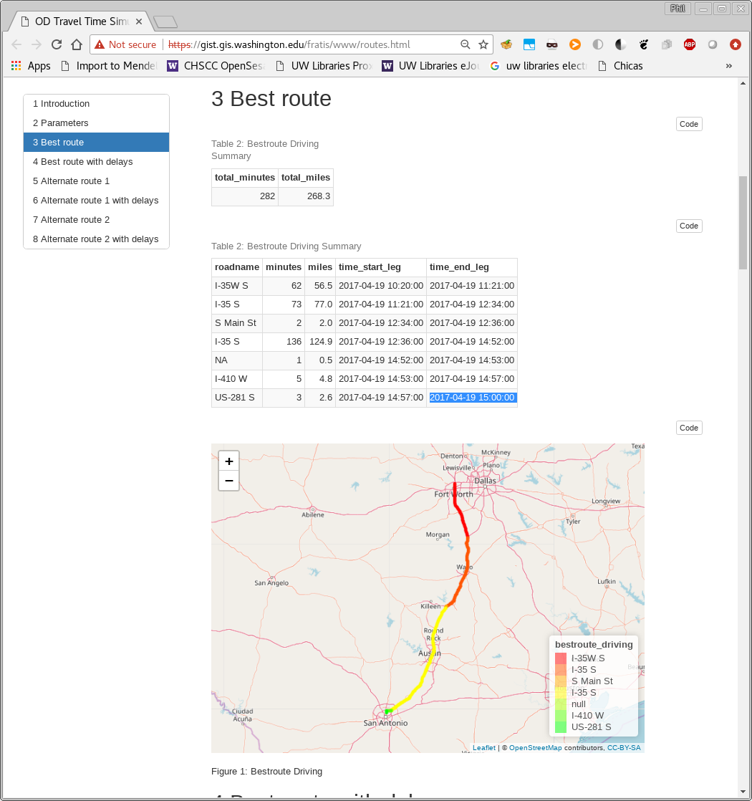
</div>
  \
`r figure_nums(name = "result2", display = "full")`

An example of output using specified start time: [results_start_time.pdf](OD_Routing/results_start_time.pdf), and one with specified arrival time: [results_arrival_time.pdf](OD_Routing/results_arrival_time.pdf).


# Appendix
This appendix contains sections with greater detail on various processes needed to prepare data for routing, including code chunks with the R and SQL code for various functions.

## Database structure
The PostgreSQL database was set up with several schemas:

1. _postgis_, where the PostGIS extension was installed
    `create schema postgis;
    create extension postgis with schema postgis`
1. _npmrds_, where geometry and speed tables are located

## Speed data
Speed data were obtained from NPMRDS for April, 2017, with one-hour measurement interval.

In the following code chunks (one for all vehicles and one for trucks only):

1. speed data were written to the database
1. average speed per TMC was calculated
1. average speed per TMC per day of week (1-7) and hour (0-23)
    Not all TMCs had measurements at every DOW/hour combination; in those cases, speeds were assigned using the average speed for the TMC across the entire measurement period.

```{r speed}
# does the speed data exist
if(!dbGetQuery(conn = fratis, statement = "select count(*) = 1 as texists from information_schema.tables where table_schema = 'npmrds' and table_name = 'speed_raw';")$texists){
# write raw speed to the db
sql <- "create table npmrds.speed_raw (
    tmc text
    , measurement_tstamp timestamptz
    ,speed float
    ,average_speed float
    ,reference_speed float
    ,travel_time_seconds float
    ,data_density text);"
O <- dbGetQuery(conn = fratis, statement = sql)

cmd <- "psql fratis -c \"\\copy npmrds.speed_raw from '/projects/fratis/npmrds/export_040318_v1/Readings.csv'\ with csv header\""
system(cmd)


sql_npmrds.speed_raw_corrected <- "
--fill in means on time data

drop table if exists npmrds.speed_raw_corrected;
create table npmrds.speed_raw_corrected as
with
--raw
tr as (select * from npmrds.speed_raw)
--min and max time stamps
, tt as (select min(measurement_tstamp), max(measurement_tstamp) from tr)
--generate a series from each time stamp
, t as (select generate_series(min, max, interval '1 hour') as measurement_tstamp from tt)
, td as (select measurement_tstamp, extract(isodow from measurement_tstamp) as iso_dow, extract(hour from measurement_tstamp) as hr from t)
--unique tmcs
, tmcs as (select distinct tmc from tr)
--combine TMCs and time stamps
, tts as (select * from td, tmcs order by tmc, measurement_tstamp)
--average over TMCs
, tmcavg as (select tmc, avg(speed) as speed_avg from tr group by tmc order by tmc)
--join and case
, f as (select distinct tmc, measurement_tstamp, coalesce(speed, speed_avg) as speed, iso_dow, hr from tr full join tts using(tmc, measurement_tstamp, iso_dow, hr) left join tmcavg using(tmc) order by tmc, measurement_tstamp)
select * from f;
create index idx_speed_raw_corrected_mc on npmrds.speed_truck_raw_corrected using btree(tmc, iso_dow, hr);"

O <- dbGetQuery(conn = fratis, statement = sql_npmrds.speed_raw_corrected)

# day of week and hour
# isodow = The day of the week as Monday(1) to Sunday(7)
# https://www.postgresql.org/docs/current/static/functions-datetime.html

sql <- "alter table npmrds.speed_raw add column iso_dow integer;
alter table npmrds.speed_raw add column hr integer;
update npmrds.speed_raw set iso_dow = extract(isodow from measurement_tstamp);
update npmrds.speed_raw set hr = extract(hour from measurement_tstamp);"
O <- dbGetQuery(conn = fratis, statement = sql)

# summaries
sql <- "
--drop and create table
--drop and create table
drop table if exists npmrds.speed_dow_hr;
create table npmrds.speed_dow_hr as
--cte
with 
--start on a Monday
d as (select '1970-01-05 00:00:00'::timestamptz as d)
--generate 2 weeks of DOWs
, day1 as (select generate_series(d.d, d.d + 13 * interval '1 day', interval '1 day') as xdate from d)
, day2 as (select row_number() over() as iso_dow, * from day1)
--get mean-filled speeds
, x as (select * from npmrds.speed_raw_corrected
)
--aggregate over DOW/hour combination
, y as (select tmc, iso_dow, hr, avg(speed) as speed from x group by tmc, iso_dow, hr order by tmc, iso_dow, hr)
--another copy incremented by a week for wraparounds
, z as (select tmc, iso_dow + 7 as iso_dow, hr, speed from y)
, f as (select * from y union all select * from z)
, f1 as (select f.*, xdate + hr * interval '1 hour' as measurement_tstamp from f join day2 using(iso_dow))
select * from f1 order by tmc, measurement_tstamp;
create index idx_speed_dow_hr on npmrds.speed_dow_hr using btree(tmc, iso_dow, hr);

--aggregate by segment to get overall estimated speed
--drop and create table
drop table if exists npmrds.speed_segment;
create table npmrds.speed_segment as
--cte
with 
x as (select *, 
    --if measured speed is null use average speed
    case when speed is null then average_speed
    else speed
    end as spd
from npmrds.speed_raw
)
--aggregate
select tmc,  avg(spd) as speed from x group by tmc order by tmc;"
O <- dbGetQuery(conn = fratis, statement = sql)
}
```

```{r speed_truck, eval=FALSE}
# because these processes take a relatively long time, eval only once.

# does the speed_truck data exist
if(!dbGetQuery(conn = fratis, statement = "select count(*) = 1 as texists from information_schema.tables where table_schema = 'npmrds' and table_name = 'speed_truck_raw';")$texists){
# write raw speed to the db
sql <- "create table npmrds.speed_truck_raw (
    tmc text
    , measurement_tstamp timestamptz
    ,speed float
    ,average_speed float
    ,reference_speed float
    ,travel_time_seconds float
    ,data_density text);"
O <- dbGetQuery(conn = fratis, statement = sql)

cmd <- "psql fratis -c \"\\copy npmrds.speed_truck_raw from '/projects/fratis/npmrds/Truck-for-I35-test/Truck-for-I35-test.csv'\ with csv header\""
system(cmd)

# day of week and hour
sql <- "alter table npmrds.speed_truck_raw add column iso_dow integer;
alter table npmrds.speed_truck_raw add column hr integer;
update npmrds.speed_truck_raw set iso_dow = extract(isodow from measurement_tstamp);
update npmrds.speed_truck_raw set hr = extract(hour from measurement_tstamp);"
O <- dbGetQuery(conn = fratis, statement = sql)

# summaries
sql <- "
--drop and create table
drop table if exists npmrds.speed_truck_dow_hr;
create table npmrds.speed_truck_dow_hr as
--cte
with 
--the first date is a Monday
d as (select '1970-01-05 00:00:00'::timestamptz as d)
--generate a series by day from the first day to first day plus 13 days (2 weeks)
, day1 as (select generate_series(d.d, d.d + 13 * interval '1 day', interval '1 day') as xdate from d)
--get isodow (day 1 = Monday)
, day2 as (select row_number() over() as iso_dow, * from day1)
--truck speeds
, x as (select * from npmrds.speed_truck_raw_corrected)
--TMC length in miles
, tmc as (select tmc, st_length(the_geom_32614) / 0.3048 / 5280 as length_mi from npmrds.roads_topo)
--aggregate -- average speed over unique isodow and hour
, y as (select tmc, iso_dow, hr, avg(speed) as speed from x group by tmc, iso_dow, hr order by tmc, iso_dow, hr)
--another copy incremented by a week for wraparounds
, z as (select tmc, iso_dow + 7 as iso_dow, hr, speed from y)
, f as (select * from y union all select * from z)
, f1 as (select f.*, xdate + hr * interval '1 hour' as measurement_tstamp from f join day2 using(iso_dow))
--join with TMC length to estimate traversal time in hours
, f2 as (select f1.*, t.length_mi, t.length_mi / f1.speed as traverse_hr from f1 join tmc as t using(tmc))
select * from f2 order by tmc, measurement_tstamp;
create index idx_speed_truck_dow_hr on npmrds.speed_truck_dow_hr using btree(tmc, iso_dow, hr);

-- aggregate by segment to get overall estimated speed
--drop and create table
drop table if exists npmrds.speed_truck_segment;
create table npmrds.speed_truck_segment as
--cte
with 
x as (select *, 
    --if measured speed is null use average speed
    case when speed is null then average_speed
    else speed
    end as spd
from npmrds.speed_truck_raw
)
--aggregate
select tmc,  avg(spd) as speed from x group by tmc order by tmc;"
O <- dbGetQuery(conn = fratis, statement = sql)
}
```


## PostGIS topology
In order for routing to work, it is necessary to have vertices at places where roads intersect. Optimally, the roads data would be structured with the correct topological linkages, but in the case of the NPMRDS data, it was necessary to force the creation of vertices.

See [Use PostGIS topologies to clean-up road networks](http://blog.mathieu-leplatre.info/use-postgis-topologies-to-clean-up-road-networks.html)

The following section shows commands and output for generating this topology for the data set used in this project.

```
--Create and associate the PostGIS topology:
select topology.createtopology('topo_npmrds',32614);
select topology.addtopogeometrycolumn('topo_npmrds','npmrds','texas','the_geom_32614_topo','LineString');
 addtopogeometrycolumn 
-----------------------
                     2
(1 row)

--Convert linestrings to vertices and edges within the topology:
UPDATE npmrds.texas SET the_geom_32614_topo = topology.toTopoGeom(the_geom_32614, 'topo_npmrds', 1, 0.5);


select topology.createtopology('topo_npmrds_roads',32614);
select topology.addtopogeometrycolumn('topo_npmrds_roads','npmrds','roads','the_geom_32614_topo','LineString');
UPDATE npmrds.roads SET the_geom_32614_topo = topology.toTopoGeom(the_geom_32614, 'topo_npmrds_roads', 1, 0.5);
```

### Join attributes, topologically split geometries, and speeds, also create id, source, and target columns:

```
drop table if exists npmrds.texas_topo;
create table npmrds.texas_topo as 
with 
--original roads
t as (select tmc, the_geom_32614_topo, roadnumber, roadname from npmrds.texas)
--relation table
, r as (select * from topo_npmrds.relation)
--edge table
, e as (select edge_id, geom as the_geom_32614 from topo_npmrds.edge)
--speed averages
, s as (select * from npmrds.speed_segment)
--join to get geoms
, f0 as (select t.tmc, t.roadnumber, t.roadname, e.the_geom_32614 from t, e, r where e.edge_id = r.element_id AND r.topogeo_id = (t.the_geom_32614_topo).id)
--join to get speeds
, f1 as (select f0.*, s.speed from f0, s where f0.tmc = s.tmc)
--translate speed to impedance, meters to miles per hour
,f2 as (select *, st_length(the_geom_32614) / 1609.34 / speed as cost,-10000000 as reverse_cost from f1)
select tmc, roadnumber, roadname, speed, cost, reverse_cost, row_number() over() as id, null::int as source, null::int as target, the_geom_32614 from f2 order by tmc;
```

### Make routable

```
fratis=# SELECT pgr_createTopology(edge_table := 'npmrds.texas_topo', tolerance := 0.5, the_geom := 'the_geom_32614', clean := true);
NOTICE:  PROCESSING:
NOTICE:  pgr_createTopology('npmrds.texas_topo', 0.5, 'the_geom_32614', 'id', 'source', 'target', rows_where := 'true', clean := f)
NOTICE:  Performing checks, please wait .....
NOTICE:  Creating Topology, Please wait...
NOTICE:  1000 edges processed
NOTICE:  2000 edges processed
NOTICE:  3000 edges processed
NOTICE:  4000 edges processed
NOTICE:  5000 edges processed
NOTICE:  6000 edges processed
NOTICE:  7000 edges processed
NOTICE:  8000 edges processed
NOTICE:  9000 edges processed
NOTICE:  10000 edges processed
NOTICE:  11000 edges processed
NOTICE:  12000 edges processed
NOTICE:  13000 edges processed
NOTICE:  14000 edges processed
NOTICE:  15000 edges processed
NOTICE:  16000 edges processed
NOTICE:  17000 edges processed
NOTICE:  18000 edges processed
NOTICE:  19000 edges processed
NOTICE:  20000 edges processed
NOTICE:  21000 edges processed
NOTICE:  22000 edges processed
NOTICE:  23000 edges processed
NOTICE:  24000 edges processed
NOTICE:  -------------> TOPOLOGY CREATED FOR  24524 edges
NOTICE:  Rows with NULL geometry or NULL id: 0
NOTICE:  Vertices table for table npmrds.texas_topo is: npmrds.texas_topo_vertices_pgr
NOTICE:  ----------------------------------------------
 pgr_createtopology 
--------------------
 OK
(1 row)
```

## Fixing geometry
It was found that geometries were missing or otherwise problematic. See figures:

Extra lines:

```{r out.width='50%'}
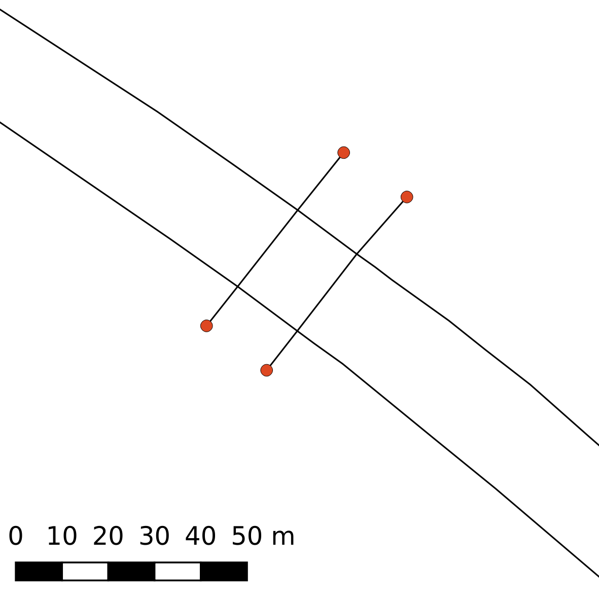
```

Missing links:

```{r out.width='50%'}
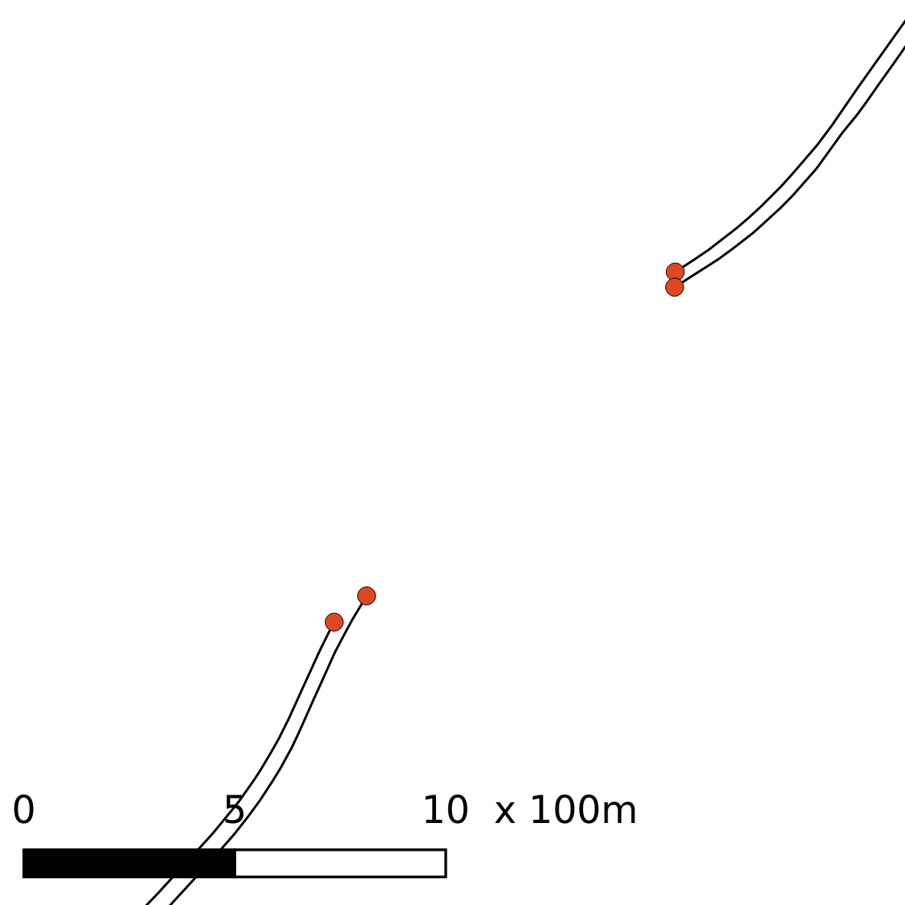
```

Missing ramps:

```{r out.width='50%'}
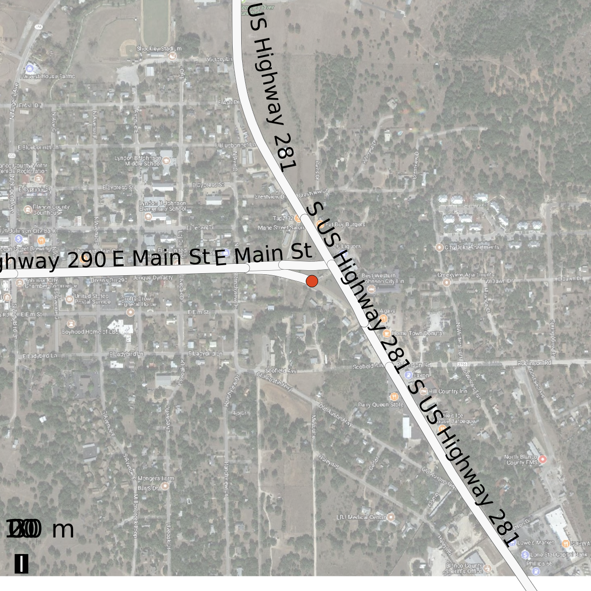
```

Missing ramp added:
    
```{r out.width='50%'}
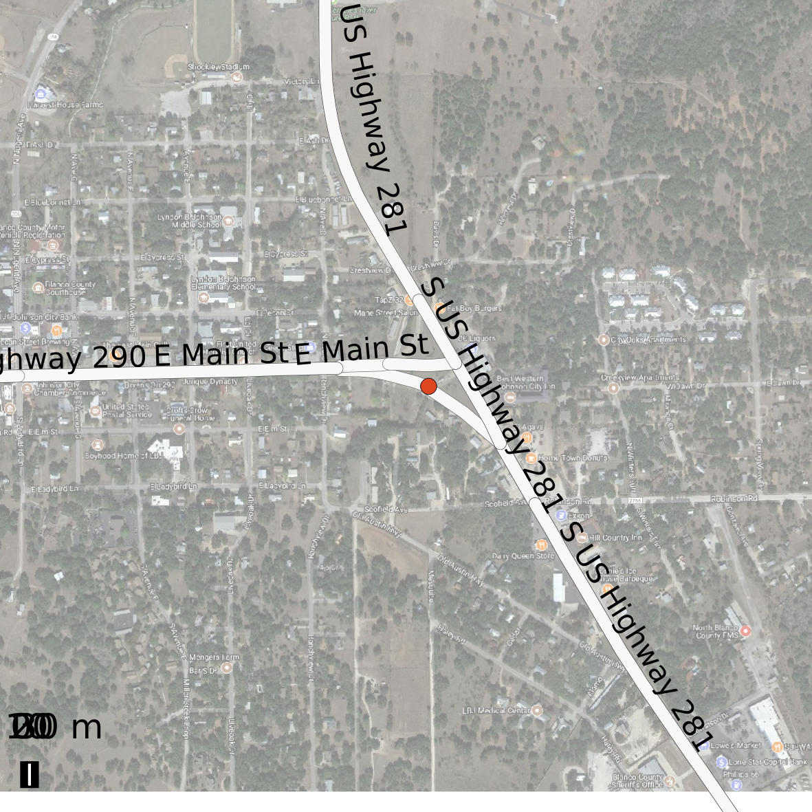
```

Misnamed roads:

```{r out.width='60%'}
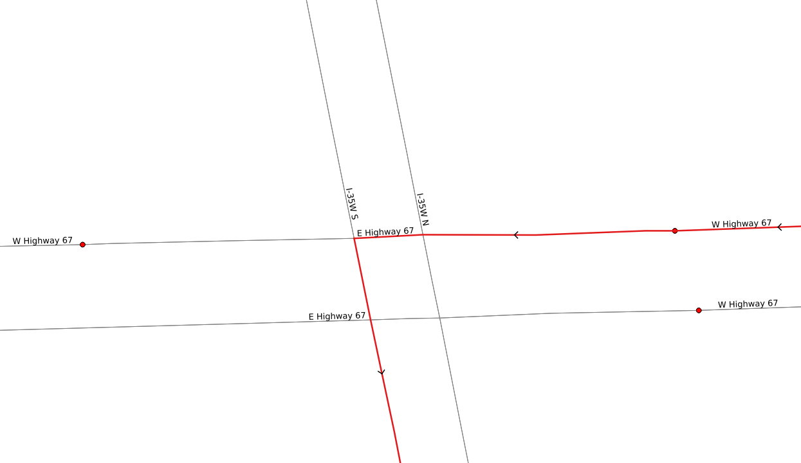
```
```{r out.width='60%'}
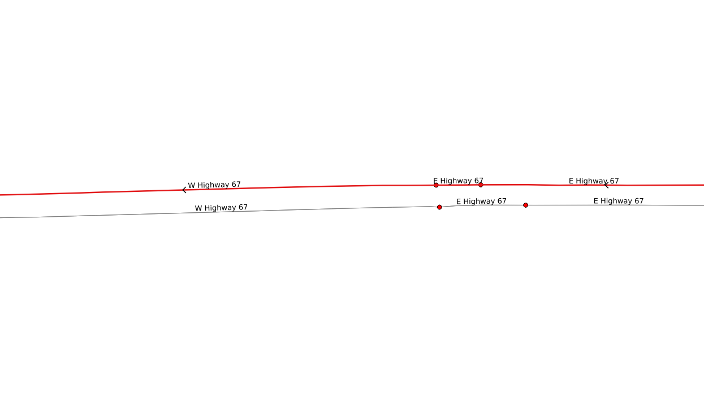
```

In order to fix missing links, all nodes that had only one connecting segment were identified (n = 1031), and each was visually inspected and repaired where applicable (generally adding missing links and connections).

Script for generating lone vertices

```
drop table if exists npmrds.lonevertex;
create table npmrds.lonevertex as 
with 
--vetices
v as (select id, the_geom_32614 from npmrds.texas_topo_vertices_pgr)
--lines
, l as (select tmc, source, target, roadname, st_length(the_geom_32614) as length_m from npmrds.texas_topo)
--texas (for f-system)
, t as (select tmc, f_system from npmrds.texas)
--lines with f system
, lt as (select * from l join t using(tmc) where f_system < 4)
--relate
, vl as (select * from v join lt on(v.id = lt.source or v.id = lt.target))
--count
, vlc as (select id, count(*) from vl group by id)
--solitaries
, vlc1 as (select * from vlc where count = 1)
, f as (select * from vlc1 order by id)
--points
, p as (select id, count, the_geom_32614 from f join v using(id))
--join back on texas_topo for attributes
, pt as (select row_number() over(order by length_m) as gid, * from p join lt on(p.id = lt.source or p.id = lt.target) order by length_m)
--select * from p;
select * from pt;
```

A copy of the roads was created for editing (`npmrds.texas_topo_edited_20180426`), which was then used to create a pgRouting topology and vertices, and its own lone vertex table:

```
alter table npmrds.texas_topo_edited_20180426 rename to roads;
SELECT pgr_createTopology(edge_table := 'npmrds.roads', tolerance := 0.5, the_geom := 'the_geom_32614', clean := true);
```

After editing the line data it was necessary to redo the PostGIS topology.

```
--This creates and updates the PostGIS topology
select topology.createtopology('topo_npmrds_roads',32614);
select topology.addtopogeometrycolumn('topo_npmrds_roads','npmrds','roads','the_geom_32614_topo','LineString');
UPDATE npmrds.roads SET the_geom_32614_topo = topology.toTopoGeom(the_geom_32614, 'topo_npmrds_roads', 1, 0.5);

--This then joins the new topology data with road attribute data
drop table if exists npmrds.roads_topo;
create table npmrds.roads_topo as 
with 
--original roads
t as (select tmc, the_geom_32614_topo, roadnumber, roadname from npmrds.roads)
--relation table
, r as (select * from topo_npmrds_roads.relation)
--edge table
, e as (select edge_id, geom as the_geom_32614 from topo_npmrds_roads.edge)
--speed averages
, s as (select * from npmrds.speed_truck_segment)
--join to get geoms
, f0 as (select t.tmc, t.roadnumber, t.roadname, e.the_geom_32614 from t, e, r where e.edge_id = r.element_id AND r.topogeo_id = (t.the_geom_32614_topo).id)
--join to get speeds
, f1 as (select f0.*, s.speed from f0, s where f0.tmc = s.tmc)
--translate speed to impedance, meters to miles per hour
,f2 as (select *, st_length(the_geom_32614) / 1609.34 / speed as cost,-10000000 as reverse_cost from f1)
select tmc, roadnumber, roadname, speed, cost, reverse_cost, row_number() over() as id, null::int as source, null::int as target, the_geom_32614 from f2 order by tmc;

SELECT pgr_createTopology(edge_table := 'npmrds.roads_topo', tolerance := 0.5, the_geom := 'the_geom_32614', clean := true);
```

## PL/pgSQL scripts
This section contains the scripts that create the functions that perform the various steps necessary to perform the routing.

### Wrapper
The `npmrds_run_wrapper` function performs a series of steps, some of which execute SQL code directly (e.g., copying from the work zone delay CSV file to a database table), and some of which call other functions that are defined in other scripts in this section (e.g., many-to-many O/D routing). The function reads a number of different parameters, as shown in [Running].

```{r, comment=''}
cat(readLines("sql/npmrds_run_wrapper.sql"), sep = "\n")
```

### Cleaner
During the routing process, tables are written to the `routing` schema. As a first step, any tables within that schema are removed.

```{r, comment=''}
cat(readLines("sql/routing_cleaner.sql"), sep = "\n")
```

### Initial routing
The function `npmrds_dijkstra_m2m_ll` generates the fastest route between an origin and destination point. The origin and destination longitude and latitude are specified; these points are then used to select a set of vertices around each O/D, and routes are generated from each pair. The fastest of the $n_{origin} \times n_{destination}$ routes is selected as output.

```{r, comment=''}
cat(readLines("sql/npmrds_dijkstra_m2m_ll.sql"), sep = "\n")
```

### Alternate routes
With the fastest route between the origin and destination, a set of alternate routes is generated using the same pair of O/D vertices as in the fastest route, but with all user-defined "via" points as intermediate locations to pass through. Similar to the initial routing function, `npmrds_dijkstra_ll_via` identifies the fastest two alternate routes.

```{r, comment=''}
cat(readLines("sql/npmrds_dijkstra_ll_via.sql"), sep = "\n")
```

### Time-stepping
The `npmrds_route_timestep_dow_hr_delay` function performs a time-stepping algorithm. Using either the desired starting or arrival time, the algorithm traverses forward or backward along the identified routes, and at each segment, estimates the duration to traverse the segment based on the average speed for the matching day-of-week and time-of-day from empirical data. Using the estimated traversal duration, the time to enter the next segment is estimated, and so on until the route is traversed. Cumulative traversal durations are calculated for the route as a whole. 

If the run-time parameter specifying a work zone delay file is included, the function will apply forecasted delay intervals to affected segments in the time-stepping algorithm.

```{r, comment=''}
cat(readLines("sql/npmrds_route_timestep_dow_hr_delay.sql"), sep = "\n")
```

### Driving instructions
Finally, after all routes are generated, contiguous segments with the same road name are coalesced, giving a table with driving instructions, including the road name, estimated length of traversal, and estimated time of starting and completing each leg.

```{r, comment=''}
cat(readLines("sql/driving_directions.sql"), sep = "\n")
```

### Shiny code
The code for the Shiny interface generates all of the widgets, and at run time performs all of the routing based on parameters specified in the interface.
```{r, comment=''}
cat(readLines("OD_Routing/app.R"), sep = "\n")
```
